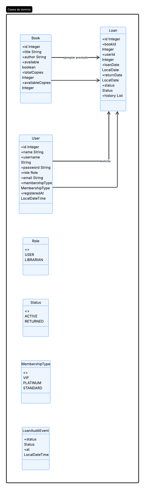
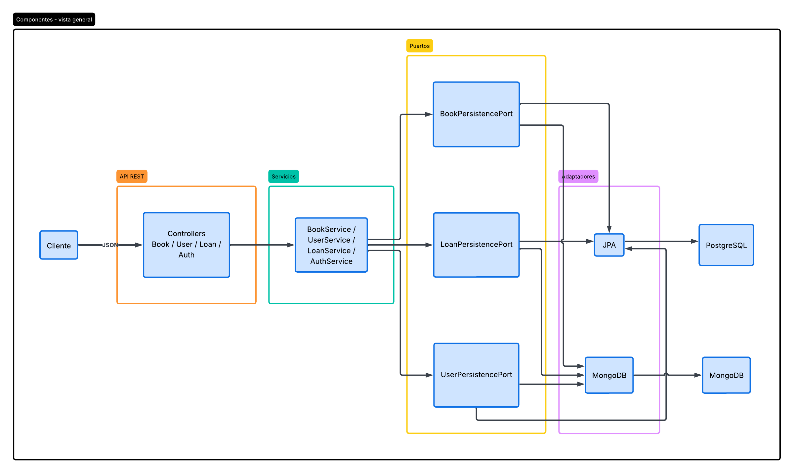
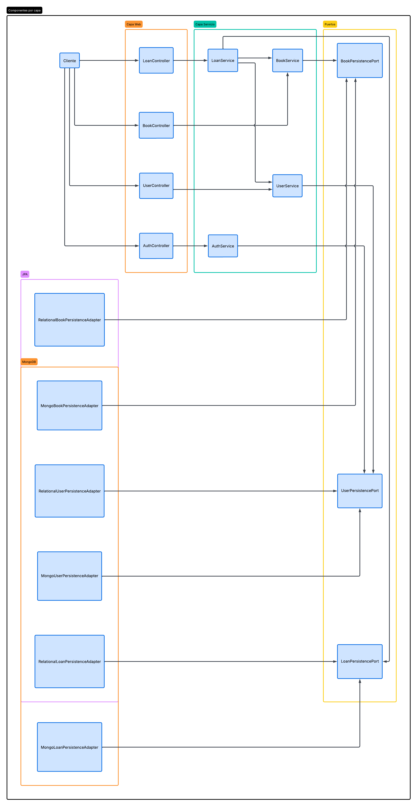
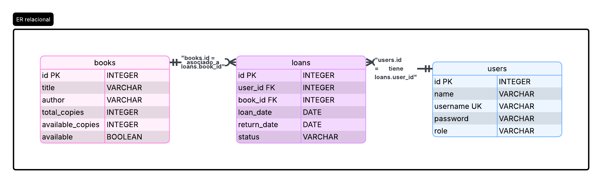
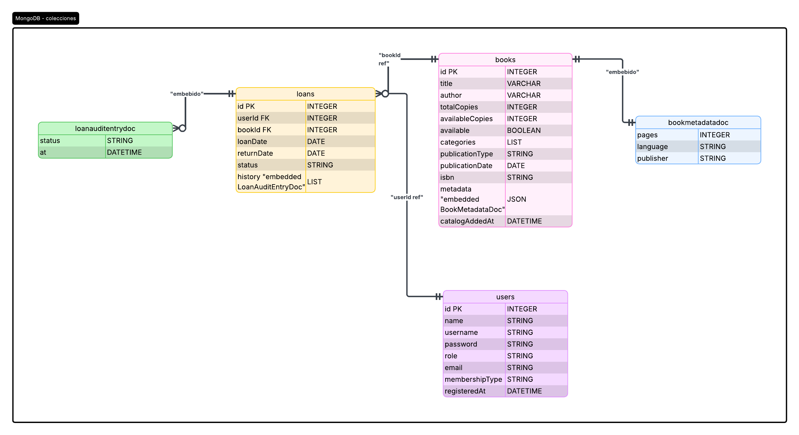

# DOSW-Library

API REST biblioteca: libros (inventario), usuarios, préstamos. JPA + PostgreSQL por defecto; perfil `mongo` con MongoDB. JWT y Swagger.

## Requisitos

- Java 21, Maven
- Postgres si usas perfil `relational` (por defecto)
- URI Mongo si usas perfil `mongo` (`MONGODB_URI`)

## Ejecutar

Base Postgres (ajusta usuario/clave si hace falta):

```sql
CREATE DATABASE dosw_library;
CREATE USER dosw WITH PASSWORD 'dosw';
GRANT ALL PRIVILEGES ON DATABASE dosw_library TO dosw;
```

```bash
./mvnw spring-boot:run
```

Mongo (Parte 3):

```bash
export SPRING_PROFILES_ACTIVE=mongo
export MONGODB_URI="mongodb+srv://..."
./mvnw spring-boot:run
```

## Swagger

`http://localhost:8080/swagger-ui.html`

## Login

`POST /auth/login` con `username` y `password`. Usuario inicial: `admin` / `Admin123!` (variables `BOOTSTRAP_LIBRARIAN_*`). Requests: `Authorization: Bearer <token>`.

## Rutas

- `/api/books` — alta, listado, por id, PATCH disponibilidad
- `/api/users` — solo `LIBRARIAN`
- `/api/loans` — crear, listar, por id, devolver; `DELETE /api/loans/{id}` solo `LIBRARIAN`

## Pruebas

```bash
./mvnw clean verify
```

JaCoCo: `target/site/jacoco/index.html` — PMD: `target/pmd.xml`

## Diagramas

Diagrama de clases:



Diagrama de componentes general:



Diagrama de componentes específico:



Diagrama db relacional:



Diagrama mongo:



## CI

`.github/workflows/ci.yml`: compile, verify, pmd, deploy placeholder.

## HTTPS / Sonar

Ver `application.yaml` (SSL). Sonar: `./mvnw verify sonar:sonar -Dsonar.login=TOKEN`
